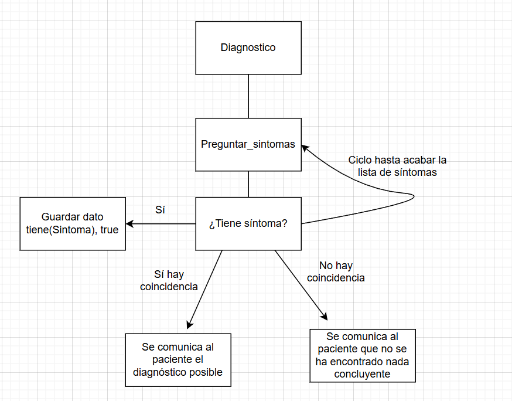

# E4 Demostración de un Paradigma de Programación (Paradigma Lógico)

Por: Mateo Rodrigo Zapata Crapa (A01708573)

## Descripción

Este es un programa en Prolog para analizar si un paciente tiene ciertas enfermedades, como gripe, resfriado, alergia o covid. 
Me pareció una idea interesante para implementar, debido a que, cada vez más, la tecnología y la automatización esta ocupando más aspectos de nuestras vidas, y el campo de la medicina no es una excepción. Ya existen sistema como chatbots que tienen una serie de respuestas y consultas según lo que el usuario le va diciendo, para irlo orientando a obtener el resultado que busca (cómo una consulta de historial o sacar una cita).
También un uso muy importante de estos servicios (y el enfoque de mi proyecto) es el poder hacer un análisis preliminar de qué tipo de afección podría estar teniendo un paciente. 
Es importante remarcar que, tanto esas soluciones ya implementadas como mi proyecto NO ofrecen un diagnóstico final, uno que siempre tendrá que ser determinado por un médico (y, muchas veces, de manera presencial), simplemente se trata de servicios orientativos que ayuden tanto al paciente como al médico hacer un primer análisis para poder proceder desde allí.
Más precisamente, elegí el paradigma lógico (y por lo tanto, hacerlo en Prolog) porque los diagnósticos (preliminares) de una aplicación así se pueden hacer enteramente estableciendo hechos (en este caso, síntomas que caracterizan a cada enfermedad) y también ciertas restricciones (excluyendo una cierta enfermedad si el paciente tiene un síntoma que no corresponde). Es cierto que es posible resolverlo mediante un lenguaje de un paradigma diferente, pero dichas soluciones sería innecesariamente complejas y poco prácticas, a comparación de esta.
Este proyecto funciona mediante escribiendo el comando "diagnostico." que activa la función de mismo nombre en el programa, que es la que ejecuta todo el proceso. Una vez dentro, se le preguntará al usuario diferentes síntomas que podría tener (o no). Esto sigue así hasta agotar la lista de síntomas, cuando el programa le informa del dianóstico posible (si hay coincidencia) o le informa que no es posible aproximar si se está padeciendo de alguna de las enfermedades más comunes cuyos síntomas principales están almacenados en este programa.

## Diseño

Cómo se ha dicho antes, este programa busca analizar los síntomas para cuatro posibles enfermedades: gripe, resfiado, alergia o covid. Para cada una, por los síntomas más comunes se han establecido las condiciones por las que el programa evaluará si se tienen o no.

Gripe: fiebre, dolor de cabeza y tos
Resfriado: estornudos, tos, SIN fiebre 
Alergia: estornudos, ojos llorosos, SIN fiebre
Covid: fiebre, tos, dificultad para respirar y pérdida de olfato

Las condiciones que son para evitar cierto síntoma sirve para evitar conflictos, ya que no se trata de un diagnóstico certero, si no del más probable. Para este fin se usa el símbolo \+ , que en Prolog significa aquella condición que, si ser necesariamente falsa (ya que el programa sólo marca explícitamente las vedaderas) no se puede verificar su certeza.
Para evitar errores se usa "dynamic tiene/1" que declara que tiene (de 1 argumento) será modificado en tiempo de ejecución, ya que por defecto Prolog no te deja, y sin esto no se podría tener en cuenta lo que el usuario le aporta.
Luego se le preguntan los síntomas al usuario que debe contestar con sí o no, los verdaderos (sí) se añaden mediante "assertz" como "true", para actualizar la base de datos.
Una vez acabado esto, el programa compara la base actualizada con las reglas que determinan si se tiene o no una enfermedad determinada. Le informa al usuario de cuál podría ser si existe una coincidencia o, si no existe tal cosa, le dice al usuario que no se ha podido determinar una enfermedad con los síntomas que le fueron dados.

El paradigma lógico es uno de los muchos paradigmas que existen en la programación, más concretamete este consiste, en un nivel muy básico en una base de datos de conocimiento de cualquier clase, y la computación se realiza aplicando lógica sobre ese conocimiento (Logic programming - Wikipedia, 2025).

## Pruebas
Se debe de abrir el archivo en Prolog o mediante una terminal que lo sepa interpretar, en este caso, ve hasta la carpeta donde está el archivo .pl e introduce "swipl evidencia4.pl".

Una vez abierto, mediante el comando diagnostico introducido como "diagnostico." e introducir "si." o "no." cada síntoma que pregunte el sistema.

1. Fiebre, dolor de cabeza y tos = Gripe
2. Estornudos y tos SIN fiebre = Resfriado
3. Estornudos y ojos llorosos SIN fiebre = Alergia
4. Fiebre, tos, dificultad para respirar y pérdida del olfato = Covid

Y aquí hay unos casos donde lo da como indeterminado:

1. Fiebre y dolor de cabeza
2. Estornudos, tos y fiebre.
3. Dificultad para respirar y ojos llorosos
4. Pérdida del olfato y estornudos.

## Análisis

Para este proyecto, aún si contiene un ciclo (para pasar por todas las enfermedades) la complejidad temporal es relativamente baja, de O(n), ya que sigue una estructura linea, siempre se pregunta el mismo número de síntomas, lo único que puede alterar un poco esto es cuando hay síntomas positivos, ya que se requiere de una instrucción extra para decirle al programa que lo guarde como síntoma verdadero, pero esto no altera la complejidad, ya que sigue siendo algo lineal.

En cuanto a la complejidad espacial, esta también es de O(n), ya que se trata de un conjunto fijo de reglas y de hechos. En el peor caso, sería del número total de síntomas dados, y en el mejor de los casos solo almacenaría las reglas sin introducir ningún hecho nuevo, ya que los hechos solo se alteran cuando el usuario dice que "sí" a algún síntoma.

Cómo se ha dicho antes, pueden existir otras soluciones en lenguajes y paradigmas diferentes, pero las funciones pueden ser más avanzadas, además del ciclo y los condicionales (en lugar de reglas) para probar cada enfermedad, esto haría que tanto la complejidad temporal y la espacial subieran. Así que, para este proyecto, esta solución es ligera, sencilla y rápida, haciendo que sea ideal.

## Referencias
Logic programming - Wikipedia. (12 de mayo de 2025). Obtenido de Wikipedia, the free encyclopedia: https://en.wikipedia.org/wiki/Logic_programming

